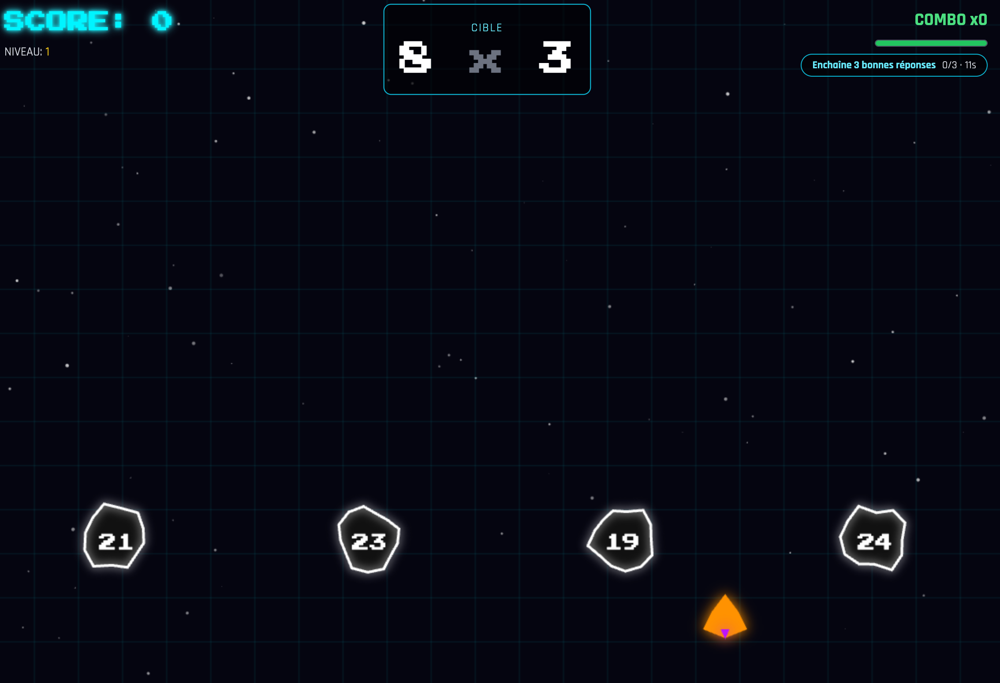

# Maths Invaders Ultimate

**Maths Invaders Ultimate** est un jeu éducatif de type "Space Shooter" rétro conçu pour rendre l'apprentissage des tables de multiplication amusant et addictif.

## 🔥 Nouveautés récentes
- **Boss toutes les 10 bonnes réponses** avec PV multiples, récompenses garanties et vitesse figée pendant l'affrontement.
- **Boss ciblé sur la table la plus faible** pour forcer la pratique là où c'est le plus utile.
- **Quêtes éclairs** (enchaîne X bonnes réponses dans un temps limité) qui donnent un power-up assuré.
- **Mur des Tables** sur l'écran stats : tuiles par table avec couleur selon la maîtrise.
- **Stats mobile-friendly** : boutons du bas repliés en grille, carré de multiplication scrollable en horizontal.

## 🎮 Comment Jouer

Le but est simple : détruisez les astéroïdes qui contiennent la bonne réponse à l'opération affichée !

### Contrôles
- **Flèches Gauche / Droite** : Déplacer le vaisseau.
- **Souris** : Déplacez la souris pour diriger le vaisseau (contrôle fluide).
- **Espace / Clic Souris** : Tirer.
- **Échap** : Quitter la partie en cours et revenir au menu.
- **Tactile (Mobile/Tablette)** : Touchez et glissez pour bouger, tapez pour tirer.

## 🚀 Modes de Jeu

1.  **Mode Marathon** : Survivez le plus longtemps possible. La difficulté augmente progressivement.
2.  **Mode Focus** : Ciblez spécifiquement vos points faibles. Le jeu sélectionne les tables où vous faites le plus d'erreurs.
3.  **Mode Apprentissage** : Idéal pour débuter. Les astéroïdes contenant la bonne réponse sont mis en évidence visuellement.

## ✨ Fonctionnalités

### Système de Progression
-   **XP & Rangs** : Gagnez de l'XP à chaque partie et montez en grade (Cadet → Pilote → Capitaine → Commandant → Légende).
-   **Vaisseaux Débloquables** : Débloquez 3 vaisseaux différents en accumulant de l'XP :
    - **Scout** (par défaut) : Agile et rapide
    - **Hunter** (5000 XP) : Design agressif
    - **Destroyer** (15000 XP) : Vaisseau lourd

### Power-ups
-   **Triple Tir** : Tirez 3 projectiles à la fois.
-   **Bouclier** : Protection contre un coup.
-   **Warp** : Accélération du temps (2.5x) pour 5 secondes - haute difficulté, haute récompense !
-   **Freeze** : Ralentissement du temps (0.2x) pour 5 secondes - parfait pour gérer les vagues difficiles.

### Apprentissage & Suivi
-   **Système d'Apprentissage Adaptatif** : Le jeu retient vos erreurs et vous propose plus souvent les calculs difficiles.
-   **Révision des Erreurs** : À la fin de chaque partie, consultez la liste des multiplications que vous avez manquées.
-   **Statistiques Détaillées** : Précision globale, score, et progression par table.
-   **Export Données** : Les professeurs ou parents peuvent exporter les résultats en CSV ou JSON pour le suivi.

### Graphismes & Audio
-   **Audio Rétro** : Effets sonores synthétisés (pew pew !) générés en temps réel via Web Audio API.
-   **Graphismes Néon** : Une esthétique Cyberpunk/Arcade moderne avec effets de particules.
-   **Animations** : Combos pop, flash de niveau, shake d'écran, et effets visuels pour les power-ups.
-   **Arrière-plan Parallaxe** : Champ d'étoiles dynamique pour plus de profondeur.

## 🛠 Installation

Aucune installation nécessaire ! Le jeu est contenu dans un seul fichier HTML.

1.  Téléchargez le fichier `index.html`.
2.  Ouvrez-le avec n'importe quel navigateur web moderne (Chrome, Firefox, Safari, Edge).
3.  Jouez !

## 👨‍💻 Technique

-   **Moteur** : Vanilla JavaScript (Canvas API).
-   **Audio** : Web Audio API (pas de fichiers mp3 externes).
-   **Style** : Tailwind CSS (via CDN) + CSS personnalisé.
-   **Stockage** : LocalStorage pour sauvegarder la progression, les statistiques et les vaisseaux débloqués.
-   **Architecture** : Système modulaire avec DataManager, MathEngine, Game, et UI.

## 🎯 Systèmes de Jeu

### Combo & Score
- Chaque bonne réponse augmente votre combo (multiplicateur de score).
- Une erreur réinitialise le combo à 0.
- Les bonnes réponses restaurent un peu de vie.

### Niveaux de Difficulté
- La vitesse des astéroïdes augmente avec le niveau.
- Le niveau augmente tous les 5 calculs réussis sur une même table.

---
*Développé pour l'apprentissage ludique des mathématiques.*
